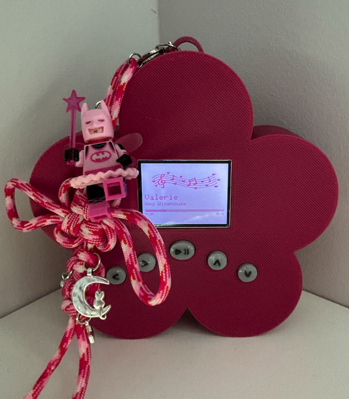

# Personalized MP3 Player

This is a fully custom MP3 player project built from scratch as part of **CS 3651: Prototyping Intelligent Devices** at Georgia Tech. It combines audio playback, interactive controls, and a graphical interface, all powered by embedded C++ on the Adafruit Feather RP2040.

## Features

- Play/Pause, Volume Up/Down, Skip, and Back buttons
- Konami Code Easter Egg: toggles visual mode
- Marquee scrolling for long song/artist names
- Playback progress bar with MM:SS timestamps
- 320x240 TFT display UI with custom colors
- LiPo battery powered and 3D-printed enclosure

## Hardware

- [Adafruit Feather RP2040](https://www.adafruit.com/product/4884)
- [DFRobot DF1201S MP3 Player Pro](www.dfrobot.com/product-2232.html)
- [2.0" ST7789 320x240 TFT display](https://www.adafruit.com/product/4311)
- Tactile pushbuttons (x5)
- 3.7V LiPo battery (JST-PH)
- Custom 3D-printed case

  
